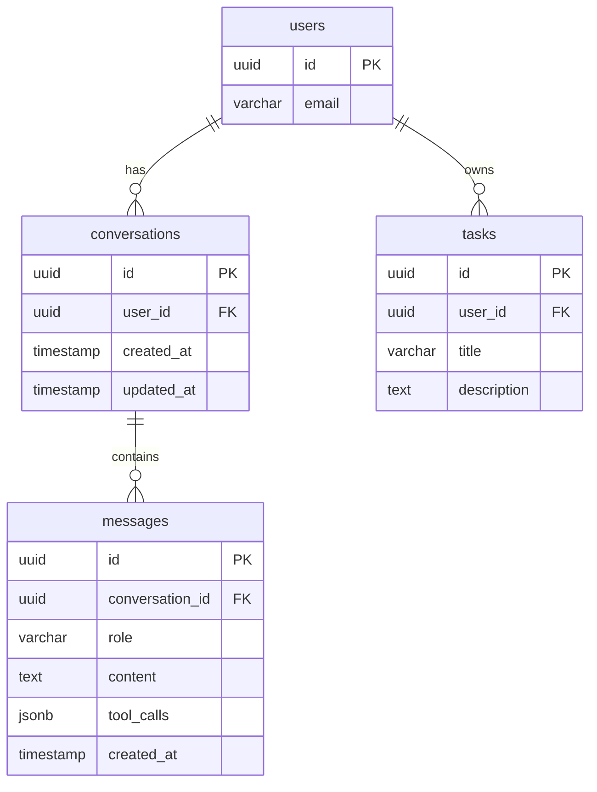

# Data Model: AI-Powered Todo Chatbot

**Feature ID**: 003-ai-chatbot-mcp
**Created**: 2026-02-08
**Status**: Planning

---

## Overview

This document defines the data model for the AI-powered chatbot feature. The design follows an **additive-only** approach, adding new tables without modifying existing Phase II infrastructure.

**Key Principles**:
- No modifications to existing `tasks` or `users` tables
- All new tables use UUID primary keys for consistency
- CASCADE DELETE ensures data cleanup on user/conversation deletion
- Indexes optimize query performance
- JSONB used for flexible tool call metadata storage

---

## Entity Relationship Diagram

```
┌─────────────────────────────────────────────────────────────────┐
│                         users (existing)                         │
│  - id: UUID (PK)                                                │
│  - email: VARCHAR                                               │
│  - ... (Better Auth fields)                                     │
└────────────────────────┬────────────────────────────────────────┘
                         │
                         │ 1:N
                         │
┌────────────────────────▼────────────────────────────────────────┐
│                      conversations (new)                         │
│  - id: UUID (PK)                                                │
│  - user_id: UUID (FK → users.id) ON DELETE CASCADE             │
│  - created_at: TIMESTAMP                                        │
│  - updated_at: TIMESTAMP                                        │
└────────────────────────┬────────────────────────────────────────┘
                         │
                         │ 1:N
                         │
┌────────────────────────▼────────────────────────────────────────┐
│                        messages (new)                            │
│  - id: UUID (PK)                                                │
│  - conversation_id: UUID (FK → conversations.id) CASCADE        │
│  - role: VARCHAR(20) CHECK ('user', 'assistant')                │
│  - content: TEXT                                                │
│  - tool_calls: JSONB (nullable)                                 │
│  - created_at: TIMESTAMP                                        │
└─────────────────────────────────────────────────────────────────┘


┌─────────────────────────────────────────────────────────────────┐
│                         tasks (existing)                         │
│  - id: UUID (PK)                                                │
│  - user_id: UUID (FK → users.id)                               │
│  - title: VARCHAR                                               │
│  - description: TEXT                                            │
│  - due_date: DATE                                               │
│  - priority: VARCHAR                                            │
│  - status: VARCHAR                                              │
│  - ... (Phase II fields)                                        │
└─────────────────────────────────────────────────────────────────┘
                         ▲
                         │
                         │ Referenced by MCP tools
                         │ (no schema changes)
```

---

## Table Definitions

### conversations

**Purpose**: Stores chat sessions between users and the AI assistant

**Schema**:
```sql
CREATE TABLE conversations (
    id UUID PRIMARY KEY DEFAULT gen_random_uuid(),
    user_id UUID NOT NULL REFERENCES users(id) ON DELETE CASCADE,
    created_at TIMESTAMP WITH TIME ZONE DEFAULT NOW(),
    updated_at TIMESTAMP WITH TIME ZONE DEFAULT NOW()
);

-- Indexes
CREATE INDEX idx_conversations_user_id ON conversations(user_id);
```

**Fields**:

| Field | Type | Constraints | Description |
|-------|------|-------------|-------------|
| `id` | UUID | PRIMARY KEY | Unique conversation identifier |
| `user_id` | UUID | NOT NULL, FK → users(id) | Owner of the conversation |
| `created_at` | TIMESTAMP WITH TIME ZONE | DEFAULT NOW() | When conversation was created |
| `updated_at` | TIMESTAMP WITH TIME ZONE | DEFAULT NOW() | Last message timestamp |

**Relationships**:
- **Belongs to**: `users` (1:1 per user in Phase III)
- **Has many**: `messages`

**Constraints**:
- `ON DELETE CASCADE`: When user is deleted, all their conversations are deleted
- Index on `user_id` for fast user lookup

**Business Rules**:
- One conversation per user in Phase III (single continuous conversation)
- Conversation created on first chat interaction
- `updated_at` updated whenever new message added
- Conversations never deleted except with user account

---

### messages

**Purpose**: Stores individual messages within conversations

**Schema**:
```sql
CREATE TABLE messages (
    id UUID PRIMARY KEY DEFAULT gen_random_uuid(),
    conversation_id UUID NOT NULL REFERENCES conversations(id) ON DELETE CASCADE,
    role VARCHAR(20) NOT NULL CHECK (role IN ('user', 'assistant')),
    content TEXT NOT NULL,
    tool_calls JSONB,
    created_at TIMESTAMP WITH TIME ZONE DEFAULT NOW()
);

-- Indexes
CREATE INDEX idx_messages_conversation_id ON messages(conversation_id);
CREATE INDEX idx_messages_created_at ON messages(created_at);
```

**Fields**:

| Field | Type | Constraints | Description |
|-------|------|-------------|-------------|
| `id` | UUID | PRIMARY KEY | Unique message identifier |
| `conversation_id` | UUID | NOT NULL, FK → conversations(id) | Parent conversation |
| `role` | VARCHAR(20) | NOT NULL, CHECK | Message sender: 'user' or 'assistant' |
| `content` | TEXT | NOT NULL | Message text content |
| `tool_calls` | JSONB | NULLABLE | Metadata about AI tool invocations |
| `created_at` | TIMESTAMP WITH TIME ZONE | DEFAULT NOW() | Message timestamp |

**Relationships**:
- **Belongs to**: `conversations`

**Constraints**:
- `ON DELETE CASCADE`: When conversation deleted, all messages deleted
- `role` must be either 'user' or 'assistant'
- Index on `conversation_id` for fast conversation retrieval
- Index on `created_at` for efficient ordering and limiting

**Business Rules**:
- Messages are immutable (never updated after creation)
- Messages ordered chronologically by `created_at`
- Last 50 messages used for AI context window
- All messages retained in database (no automatic deletion)

**tool_calls JSONB Structure**:
```json
{
  "calls": [
    {
      "tool": "add_task",
      "arguments": {
        "title": "Buy groceries",
        "due_date": "2026-02-09",
        "priority": "medium"
      },
      "result": "success",
      "task_id": "abc-123-def"
    }
  ]
}
```

---

## SQLModel Definitions

### Conversation Model

**File**: `backend/src/models/conversation.py`

```python
from sqlmodel import SQLModel, Field, Relationship
from datetime import datetime
from typing import Optional, List
import uuid

class Conversation(SQLModel, table=True):
    """
    Represents a chat session between a user and the AI assistant.

    In Phase III, each user has one continuous conversation.
    Future phases may support multiple conversation threads.
    """
    __tablename__ = "conversations"

    id: uuid.UUID = Field(
        default_factory=uuid.uuid4,
        primary_key=True,
        description="Unique conversation identifier"
    )

    user_id: uuid.UUID = Field(
        foreign_key="users.id",
        index=True,
        description="Owner of this conversation"
    )

    created_at: datetime = Field(
        default_factory=datetime.utcnow,
        description="When conversation was created"
    )

    updated_at: datetime = Field(
        default_factory=datetime.utcnow,
        description="Last message timestamp"
    )

    # Relationships
    messages: List["Message"] = Relationship(
        back_populates="conversation",
        sa_relationship_kwargs={"cascade": "all, delete-orphan"}
    )

    def update_timestamp(self):
        """Update the updated_at timestamp when new message added"""
        self.updated_at = datetime.utcnow()
```

---

### Message Model

**File**: `backend/src/models/message.py`

```python
from sqlmodel import SQLModel, Field, Relationship, Column
from sqlalchemy import JSON
from datetime import datetime
from typing import Optional, Dict, Any
import uuid

class Message(SQLModel, table=True):
    """
    Represents a single message in a conversation.

    Messages are immutable once created. The role field indicates
    whether the message is from the user or the AI assistant.
    """
    __tablename__ = "messages"

    id: uuid.UUID = Field(
        default_factory=uuid.uuid4,
        primary_key=True,
        description="Unique message identifier"
    )

    conversation_id: uuid.UUID = Field(
        foreign_key="conversations.id",
        index=True,
        description="Parent conversation"
    )

    role: str = Field(
        max_length=20,
        description="Message sender: 'user' or 'assistant'"
    )

    content: str = Field(
        description="Message text content"
    )

    tool_calls: Optional[Dict[str, Any]] = Field(
        default=None,
        sa_column=Column(JSON),
        description="Metadata about AI tool invocations"
    )

    created_at: datetime = Field(
        default_factory=datetime.utcnow,
        index=True,
        description="Message timestamp"
    )

    # Relationships
    conversation: Conversation = Relationship(back_populates="messages")

    @property
    def is_user_message(self) -> bool:
        """Check if message is from user"""
        return self.role == "user"

    @property
    def is_assistant_message(self) -> bool:
        """Check if message is from assistant"""
        return self.role == "assistant"
```

---

## Database Queries

### Common Query Patterns

**Get or Create User's Conversation**:
```python
async def get_or_create_conversation(
    user_id: uuid.UUID,
    db: Session
) -> Conversation:
    """
    Get user's existing conversation or create new one.
    In Phase III, each user has one continuous conversation.
    """
    conversation = db.query(Conversation).filter(
        Conversation.user_id == user_id
    ).first()

    if not conversation:
        conversation = Conversation(user_id=user_id)
        db.add(conversation)
        db.commit()
        db.refresh(conversation)

    return conversation
```

**Retrieve Last N Messages**:
```python
async def get_recent_messages(
    conversation_id: uuid.UUID,
    limit: int = 50,
    db: Session
) -> List[Message]:
    """
    Retrieve the most recent N messages from a conversation.
    Used to build AI context window.
    """
    messages = db.query(Message).filter(
        Message.conversation_id == conversation_id
    ).order_by(
        Message.created_at.desc()
    ).limit(limit).all()

    # Reverse to get chronological order (oldest first)
    return list(reversed(messages))
```

**Save Message**:
```python
async def save_message(
    conversation_id: uuid.UUID,
    role: str,
    content: str,
    tool_calls: Optional[Dict] = None,
    db: Session
) -> Message:
    """
    Save a new message to the conversation.
    Updates conversation's updated_at timestamp.
    """
    message = Message(
        conversation_id=conversation_id,
        role=role,
        content=content,
        tool_calls=tool_calls
    )

    db.add(message)

    # Update conversation timestamp
    conversation = db.query(Conversation).filter(
        Conversation.id == conversation_id
    ).first()
    conversation.update_timestamp()

    db.commit()
    db.refresh(message)

    return message
```

**Get Conversation with Messages**:
```python
async def get_conversation_with_messages(
    conversation_id: uuid.UUID,
    db: Session
) -> Optional[Conversation]:
    """
    Retrieve conversation with all messages loaded.
    Use with caution for large conversations.
    """
    return db.query(Conversation).filter(
        Conversation.id == conversation_id
    ).options(
        joinedload(Conversation.messages)
    ).first()
```

---

## Migration Strategy

### Alembic Migration

**File**: `backend/alembic/versions/003_add_chat_tables.py`

```python
"""Add chat tables for AI chatbot feature

Revision ID: 003_add_chat_tables
Revises: 002_phase_2_tables
Create Date: 2026-02-08

"""
from alembic import op
import sqlalchemy as sa
from sqlalchemy.dialects import postgresql
import uuid

# revision identifiers
revision = '003_add_chat_tables'
down_revision = '002_phase_2_tables'
branch_labels = None
depends_on = None

def upgrade():
    # Create conversations table
    op.create_table(
        'conversations',
        sa.Column('id', postgresql.UUID(as_uuid=True), primary_key=True, default=uuid.uuid4),
        sa.Column('user_id', postgresql.UUID(as_uuid=True), nullable=False),
        sa.Column('created_at', sa.TIMESTAMP(timezone=True), server_default=sa.text('NOW()')),
        sa.Column('updated_at', sa.TIMESTAMP(timezone=True), server_default=sa.text('NOW()')),
        sa.ForeignKeyConstraint(['user_id'], ['users.id'], ondelete='CASCADE'),
    )

    # Create index on user_id
    op.create_index('idx_conversations_user_id', 'conversations', ['user_id'])

    # Create messages table
    op.create_table(
        'messages',
        sa.Column('id', postgresql.UUID(as_uuid=True), primary_key=True, default=uuid.uuid4),
        sa.Column('conversation_id', postgresql.UUID(as_uuid=True), nullable=False),
        sa.Column('role', sa.VARCHAR(20), nullable=False),
        sa.Column('content', sa.TEXT, nullable=False),
        sa.Column('tool_calls', postgresql.JSONB, nullable=True),
        sa.Column('created_at', sa.TIMESTAMP(timezone=True), server_default=sa.text('NOW()')),
        sa.ForeignKeyConstraint(['conversation_id'], ['conversations.id'], ondelete='CASCADE'),
        sa.CheckConstraint("role IN ('user', 'assistant')", name='check_message_role'),
    )

    # Create indexes
    op.create_index('idx_messages_conversation_id', 'messages', ['conversation_id'])
    op.create_index('idx_messages_created_at', 'messages', ['created_at'])

def downgrade():
    # Drop tables in reverse order
    op.drop_index('idx_messages_created_at', table_name='messages')
    op.drop_index('idx_messages_conversation_id', table_name='messages')
    op.drop_table('messages')

    op.drop_index('idx_conversations_user_id', table_name='conversations')
    op.drop_table('conversations')
```

### Migration Execution

```bash
# Generate migration (if using auto-generate)
alembic revision --autogenerate -m "Add chat tables for AI chatbot"

# Review generated migration
cat backend/alembic/versions/003_add_chat_tables.py

# Run migration on development
alembic upgrade head

# Test rollback
alembic downgrade -1
alembic upgrade head

# Run on production (zero downtime)
alembic upgrade head
```

---

## Data Retention & Privacy

### GDPR Compliance

**User Deletion**:
- When user deletes account, CASCADE DELETE removes all conversations and messages
- No orphaned data remains
- Deletion is immediate and irreversible

**Data Export**:
- Users can export their conversation history
- Export includes all messages with timestamps
- Format: JSON or CSV

**Data Minimization**:
- Only store necessary data (no IP addresses, device info)
- No logging of message content (only metadata)
- Tool calls logged for debugging but not user-identifiable

### Storage Estimates

**Per User**:
- Average message: ~200 bytes (content) + ~100 bytes (metadata) = 300 bytes
- 100 messages per user: ~30 KB
- 1000 users: ~30 MB

**Growth Projection**:
- 10,000 active users
- 50 messages per user per month
- Monthly growth: ~150 MB
- Annual growth: ~1.8 GB (negligible for Neon PostgreSQL)

---

## Performance Considerations

### Query Optimization

**Indexes**:
- `conversations.user_id`: Fast user lookup (O(log n))
- `messages.conversation_id`: Fast conversation retrieval (O(log n))
- `messages.created_at`: Efficient ordering and limiting (O(log n))

**Query Performance**:
- Get conversation: ~1-5ms (indexed lookup)
- Get last 50 messages: ~5-10ms (indexed + limit)
- Save message: ~5-10ms (insert + update)

**Connection Pooling**:
- Min connections: 5
- Max connections: 20
- Connection timeout: 30 seconds

### Scaling Considerations

**Horizontal Scaling**:
- Stateless design allows multiple backend instances
- Any instance can handle any user's request
- Database is single source of truth

**Vertical Scaling**:
- Neon PostgreSQL auto-scales compute
- Storage grows automatically
- No manual intervention needed

**Archival Strategy** (Future):
- Archive messages older than 1 year
- Move to cold storage (S3)
- Keep last 50 messages in hot storage

---

## Testing Data

### Seed Data for Development

```python
# backend/tests/seed_chat_data.py

async def seed_chat_data(db: Session):
    """Create test conversations and messages for development"""

    # Get test user
    user = db.query(User).filter(User.email == "test@example.com").first()

    # Create conversation
    conversation = Conversation(user_id=user.id)
    db.add(conversation)
    db.commit()

    # Add sample messages
    messages = [
        Message(
            conversation_id=conversation.id,
            role="user",
            content="Show me my tasks for today"
        ),
        Message(
            conversation_id=conversation.id,
            role="assistant",
            content="You have 3 tasks due today: 1) Buy groceries 2) Call dentist 3) Submit report",
            tool_calls={"calls": [{"tool": "list_tasks", "arguments": {"status": "pending"}}]}
        ),
        Message(
            conversation_id=conversation.id,
            role="user",
            content="Mark the first one done"
        ),
        Message(
            conversation_id=conversation.id,
            role="assistant",
            content="Great! I've marked 'Buy groceries' as complete.",
            tool_calls={"calls": [{"tool": "complete_task", "arguments": {"task_id": "abc-123"}}]}
        ),
    ]

    for msg in messages:
        db.add(msg)

    db.commit()
```

---

## Appendices

### A. Database Diagram (Mermaid)



### B. Sample Queries

See `contracts/sample-queries.sql` for additional query examples

---

**Data Model Status**: ✅ APPROVED - Ready for Implementation

**Next Steps**:
1. Review data model with team
2. Create Alembic migration
3. Test migration on development database
4. Proceed with implementation
